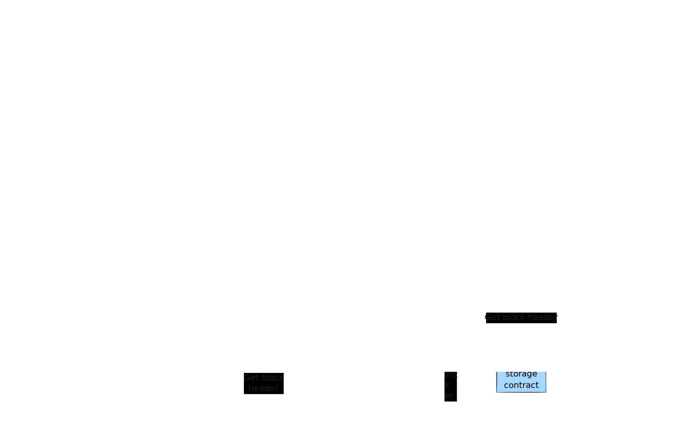

# Crosschain messaging protocol

## Overview

In the evolving crypto market, blockchain interoperability is crucial for enabling asset swaps and crosschain communication. This project aims to design a crosschain messaging protocol that ensures seamless communication and asset transfer between blockchains.

## Value proposition

For blockchain developers and sophisticated crypto builders

- ...who need seamless, secure, and scalable cross-chain communication and asset transfer
- ...our product is a cross-chain messaging protocol
- ...that enables efficient interoperability across multiple blockchains while ensuring trust and security.

Unlike existing cross-chain solutions

...our product combines modular architecture with zero-knowledge proofs, offering enhanced security, flexibility, and a clear path to decentralization.

## Key components

- **Sender contract**: Integrates with smart contracts to securely emit and store messages on the source chain.
- **Attester**: Generates and signs Merkle proofs to verify message validity.
- **Relayer**: Transmits the message package, ensuring reliable delivery and modular design.
- **Receiver contract**: Verifies Merkle proofs and block headers on the destination chain.
- **Block header oracle**: Provides secure and timely block headers.
- **Block header storage contract**: Stores and provides trusted block headers for validation.

## Feedback

Feel free to send me a message:

- X: @JoaoOfAllTrades
- Email: azommerfelds@gmail.com
